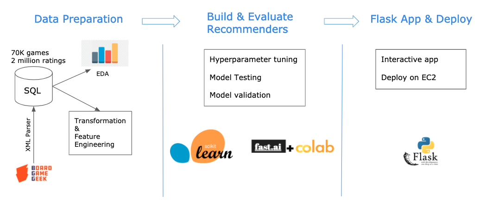

# Board Game Recommender
 Janki Chauhan
 
[Linkedin](https://www.linkedin.com/in/jankichauhan/) | [Github](https://github.com/jankichauhan) | [Board Game Geek](https://boardgamegeek.com/user/jankichauhan)

## Contents

* [Motivation](#motivation)
* [Data Exploration](#data-exploration)
  * [Data Pipeline](#pipeline-source)
  * [Analysis](#analysis)
* [Recommenders](#recommender)
  * [Popular recommender](#popular)
  * [Content base filtering](#content)
  * [Collaborative filtering](#collabrative)
* [Conclusion](#conclusion)
* [Future Analysis](#future-analysis)

## Motivation

## Data Exploration

### Data Pipeline

 
 
Data Source: [BGG API](https://boardgamegeek.com/wiki/page/BGG_XML_API)

### Analysis

Each board game has the following fields:  
  > -`board game id` 
  > -`name` 
  > -`year published` 
  > -`min player` 
  > -`max player`
  > -`playing time`
  > -`rating`
  > -`designers`
  > -`categories`
  > -`game mechanic`
  > -`publishers`
  > -`user rating count`
  > -`age`
  > -`bgg rank`
  > -`category rank`

Each user rating has the following field.  
  > -`user id` 
  > -`bgg user handle` 
  > -`board game id` 
  > -`board game name` 
  > -`rating`
  > -`review`

#### Number of board games published in last 20 years
 
 
 
 #### Ratings distribution over number of reviews
 
 
 
 #### Most common words used in highly rated games and poorly rated games
 
  
 
 
 ## Recommenders
 
 ### Popular recommender
 
 ### Content based recommender
 
 ### Collaborative recommender
 
 ## Conclusion
 
 ## Future Analysis

