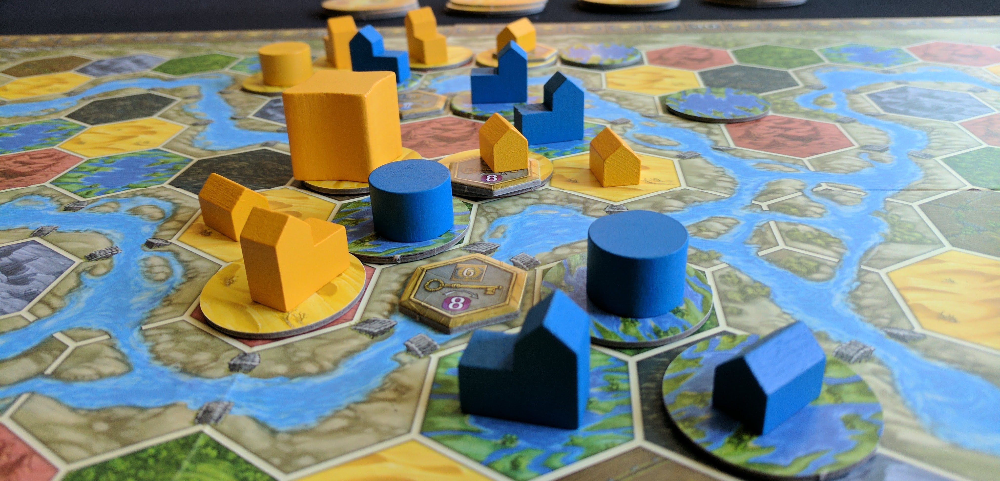
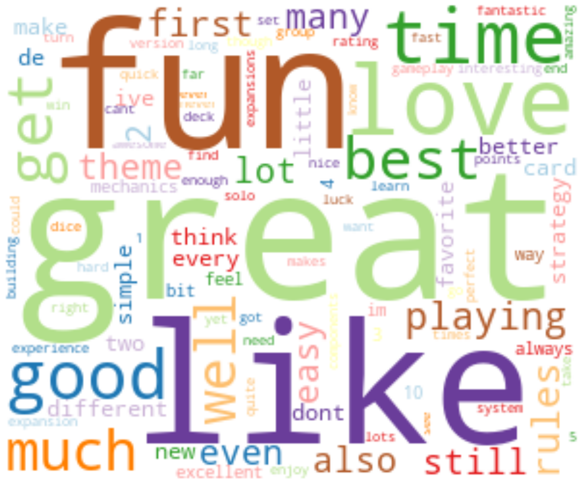
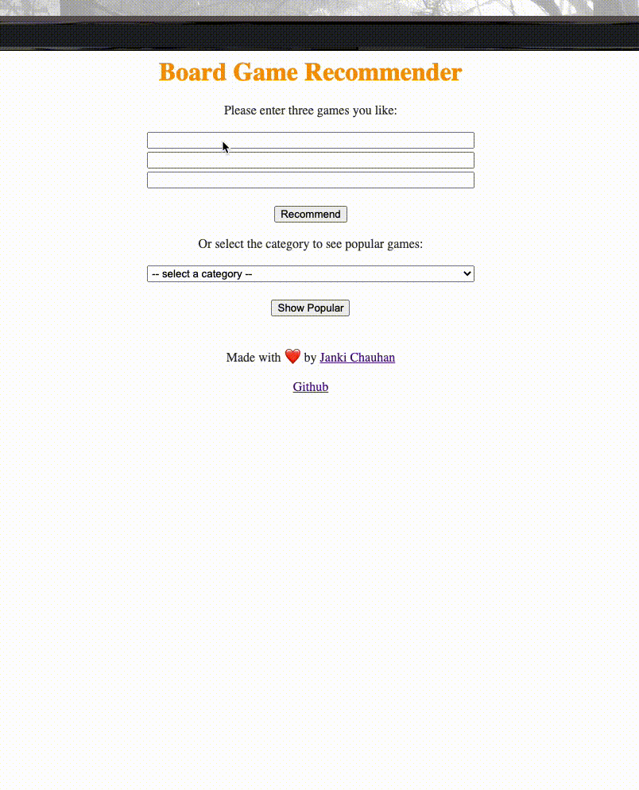

# What board game should I play next?
**Personalized board game recommender**

 Janki Chauhan
 
[Linkedin](https://www.linkedin.com/in/jankichauhan/) | [Github](https://github.com/jankichauhan) | [Board Game Geek](https://boardgamegeek.com/user/jankichauhan)

## Contents

* [Motivation](#motivation)
* [Data Exploration](#data-exploration)
  * [Data Pipeline](#pipeline-source)
  * [Analysis](#analysis)
* [Recommenders](#recommender)
  * [Popular recommender](#popular)
  * [Content based filtering](#content)
  * [Collaborative filtering](#collaborative)
* [Result](#result)
* [For Future](#future)

## Motivation
I got introduced to board games in Dec 2010, no one had plans for the holidays and we all had enough of movie watching. We played Ticket to Ride and then Settler of Catan a few days later; it was so much fun, I loved it. Since then it has been board games over movies(for me!) When you have been playing board games for 10 years, you start developing your favorites. I am biased towards Euro games(specially worker placement games), any game by Jamey Stegmaier or Uwe Rosenberg I am willing to give a try. On the other hand card games are not in my top 10. Dominion is one of the best gateway games but it didn't appeal to me. For finding the next game to play, I rely on amazing people at [Dice Tower](www.dicetower.com)(this a youtube channel for board games reviews, play throughs ... etc). Most of the time their recommendations are a hit but occasionally there are misses too. 
My goal is to design a reliable recommender that learns from users and the games they have rated and generated a list of recommended similar games. 

## Data Exploration

### Data Pipeline

 
Data Source: [BGG API](https://boardgamegeek.com/wiki/page/BGG_XML_API)

### Analysis

Each board game has the following features: ~70K games
  > -`board game id` 
  > -`name` 
  > -`year published` 
  > -`min player` 
  > -`max player`
  > -`playing time`
  > -`rating`
  > -`designers`
  > -`categories`
  > -`game mechanic`
  > -`publishers`
  > -`user rating count`
  > -`age`
  > -`bgg rank`
  > -`category rank`

Each user rating has the following features: ~12M ratings(200K unique users and 30K unique games)
  > -`user id` 
  > -`bgg user handle` 
  > -`board game id` 
  > -`board game name` 
  > -`rating`
  > -`review`

#### Number of board games published by year, by categories. 
 
 
 
 #### Ratings distribution over number of reviews
 
 
 
 #### Most common words used in highly rated games and poorly rated games
 
  
 
 
 ## Recommenders
 
 ### Popularity recommender
 
 Popularity criteria = game weight based on rank and number of voters
 
 Popularity recommender will recommend the games based popularity criteria
 User can choose to pick one of the following categories and the recommender will return popular games based of that category:
 > - Abstract Game
 > - Children's Game
 > - Family Game
 > - Party Game
 > - Strategy Game
 > - Thematic Game
 > - War Game
 
 ### Content based recommender
 
Find the similarity between all pairs of games, then use the most similar games to a user’s already-rated items to generate a list of recommendations.

Similarity is defined using following features:
>- Category
>- Designer
>- Complexity
>- Mechanism

 
 
 > - Method(s):
 >>- Countvectorizer 
 >>- Cosine similarity
 
 
 
 ### Collaborative recommender
 
A collaborative model computes item to item similarity based on users that rated those games and given a game finds the nearest neighbor based on the similarity weight.
 
 
 
 > - Method(s):
 >> - ALS: 
 >>>- Reg param - 0.05
 >>>- Max Iterations - 15
 >>>- Rank - 5
 >>>- Test RMSE - 2.3
 
 >> - Fast AI + KNN: 
 >>>- Epoch - 3
 >>>- Learning rate - 1e-2
 >>>- Weight decay - 0.15
 >>>- Train Loss - 0.86
 >>>- Validation Loss - 1.5
 >>>- RMSE - 1.23
 >>>- No of neighbours(knn) - no of games
 
 Seeing the games in a top two dimensions of pca. 

 

 ## Result
 > - Flask app demo:
 
 
 ## For Future
>- Include an option of using bgg username and recommend games based on users past activity. 
>- Build a better content based recommender.
>- Update recommender to handle live data.

To run the recommender follow instruction from RUN.md
